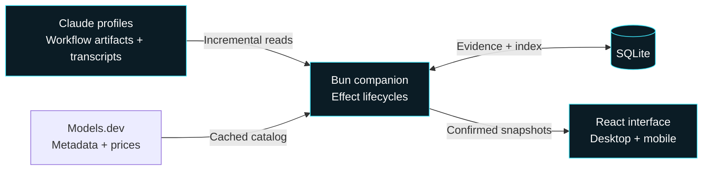

# Workflow Observer

<p align="center">
  
</p>

<p align="center">
  <a href="https://www.npmjs.com/package/workflow-observer"></a>
  <a href="https://github.com/malhashemi/workflow-observer/actions/workflows/ci.yml"></a>
  <a href="https://github.com/malhashemi/workflow-observer/blob/main/LICENSE"></a>
  <a href="https://bun.sh"></a>
</p>

**See what your Claude workflows are doing—and what they cost.** Observer brings live runs, session totals and recorded evidence from multiple projects into one local web app.

<p align="center">
  <a href="#start">Quick start</a> ·
  <a href="#see-it-in-action">Screenshots</a> ·
  <a href="#how-it-works">How it works</a> ·
  <a href="#usage-and-reference">Reference</a> ·
  <a href="https://github.com/malhashemi/workflow-observer/blob/main/CONTRIBUTING.md">Contribute</a>
</p>

- **Follow the whole session.** Group workflows by recorded session name, with separate costs for the parent conversation and agents.
- **See the plan and the work.** Browse declared phases and resolvable planned models, then expand live agent details in place.
- **Check the evidence.** Inspect exact model IDs, token usage, pricing, highlighted source and recorded edits.
- **Take it with you.** Open on your phone through Tailscale or your local network, with QR links to individual workflows.

Observer reads compatible **Claude Workflow tool** artifacts across configurable profiles. Your workflow content stays on your machine; the app works with the bundled model catalog when offline.

## Start

```sh
bunx workflow-observer
```

The command starts the local companion and opens **http://127.0.0.1:4319**. If it is already running with the same config, it opens the existing app. No Node runtime or API key is needed. Keep the foreground process running, or use `--background`.

Requires [Bun 1.3.14 or newer](https://bun.sh). Observer discovers `~/.claude` by default. Add more profiles in **Settings → Sources / Models**. The library opens to the last seven days; switch to 24 hours, 30 days or 90 days when needed.

Prefer a global command?

```sh
bun add --global workflow-observer
workflow-observer
workflow-observer update
```

```sh
bunx workflow-observer --background
bunx workflow-observer --no-open
bunx workflow-observer stop
bunx workflow-observer --config ~/my-observer.json --port 4320
```

The companion must remain running to serve the app and read local evidence. A source checkout also includes a macOS double-click launcher, **Open Workflow Observer.command**, available after building.

## See it in action

### One view across projects and sessions

Find the active run, revisit finished work and see session-level token and API cost estimates without switching between Claude profiles.


### From a phase to its evidence

Keep the workflow in view while inspecting an agent's model, progress, usage and output. Future phases show source-declared plans where the recorded arguments can resolve them.


<details>
<summary><strong>On your phone, too</strong></summary>

<p align="center">
  
</p>

Enable **Settings → Access → Tailscale** or local-network access, choose your default sharing address, and open **Share** to scan the QR code. Both devices must be able to reach that network.

</details>

Screenshots use synthetic demo workflows, not private session data. Costs are API-equivalent estimates at catalog rates, not subscription charges or invoices. Missing evidence and unpriced requests remain explicit.

## How it works

One Bun process serves the React interface and indexes local evidence in SQLite. Effect manages discovery, settings updates and browser observation; OXC checks and formats the code.



Observer leaves Claude's files untouched and analyzes workflow source without executing it. If a transcript disappears or becomes unreadable, its cached content is hidden and its usage is excluded. A fresh browser load confirms the current index before showing saved content.

## Usage and reference

<details>
<summary><strong>Configuration, sharing, model matching, accounting and architecture</strong></summary>

The sections below document the current behavior and its limits.

## Access, sharing and tool actions

The local port is **4319** by default and never changes automatically because of a conflict. **Settings → Access** controls the local port, browser opening, local-network access and Tailscale HTTPS access. New installations enable neither network option. Preferences are saved in the same user config as directories and aliases.

For an editor/tool action, use command `bunx workflow-observer --background --no-open` and preview URL `http://127.0.0.1:4319/` (or your configured port). A global installation can omit `bunx`. Settings provides copyable command/preview fields. `workflow-observer url --local` prints the running local endpoint; `url --remote` prints the confirmed **default sharing** endpoint. Plain `url` uses the preferred browser-opening address. These commands do not start Observer or enable access.

Tailscale requires an installed, connected Tailscale client. Observer detects its full MagicDNS hostname and manages one private Serve HTTPS endpoint, default port **8443**. That port is configurable independently of the local port. Existing Serve routes are preserved; conflicts are reported, and disabling/stopping Observer removes only its matching owned route. Login, HTTPS setup, routing or permission failures appear separately from a successful config save. HTTPS is marked ready only after it reaches the expected Observer instance. Your phone must be connected to the permitted tailnet and this computer must remain running.

Local-network access supports private IPv4 interfaces (10.x, 172.16–31.x, 192.168.x). It makes Observer available to other devices that can reach those interfaces; use it on a network where that is intended. The device must be on the same reachable network. Network firewalls can still prevent another device from connecting even when the listener is ready. IPv6-only LAN discovery is not included in this release.

**Share** opens a QR modal from the library, Access settings, or a workflow. It closes through the close button, outside click, or Escape. Set **Default sharing address** to LAN or Tailscale; every modal starts with that saved choice. Switching inside the modal affects only that share. An unavailable default shows an explanation and no QR until you choose an available network. Loopback is never shared as a phone link. QR generation is entirely local; the QR contains only the confirmed network URL. Workflow links include their key and selected date window so an older workflow opens in the same window. Each receiving browser still confirms the current index and enforces transcript deletion before showing saved content.

**Open by default** is a separate setting: the CLI can open locally on your computer while QR sharing defaults to Tailscale. A plain HTTP LAN origin supports snapshots and copying through compatible browser fallbacks.

## Versions and updates

```sh
workflow-observer --version
workflow-observer update --check
workflow-observer update
workflow-observer restart --background --no-open
```

`update` supports verified Bun/npm global installations. It stages and validates the selected published release before invoking the original package manager, then reports installation and companion restart separately. A development link is updated through its checkout; a bunx execution can select `bunx workflow-observer@latest`. Settings → Updates distinguishes the installed package, running companion and checked latest version.

Each companion serves an immutable runtime snapshot under its data directory. Installing another package version cannot remove its active browser chunks. Starting the same build reuses the companion; a different build asks for an explicit `restart`. A newer running version cannot be silently downgraded. One process owns a data directory's index, with a process-lifetime SQLite lock coordinating simultaneous starts. Shutdown waits for in-flight indexing, and CLI control checks the instance UUID instead of signaling an unverified PID. Runtime release snapshots are retained on disk; this release does not automatically prune them.

## Configuration

On first launch, Observer creates `~/.config/workflow-observer/config.json`:

```json
{
  "version": 1,
  "claudeDirectories": ["~/.claude"],
  "port": 4319,
  "openBrowser": true,
  "modelAliases": {}
}
```

Only `~/.claude` is included by default. Add any additional profiles through **Settings → Sources / Models**, by editing the JSON, or with the CLI:

```sh
bunx workflow-observer config path
bunx workflow-observer config show
bunx workflow-observer config add ~/.claude-t3-mixed
bunx workflow-observer config add /Volumes/Work/claude-profile
bunx workflow-observer config remove /Volumes/Work/claude-profile
```

Browser changes acknowledge the durable file save immediately, then show **Updating estimates…**. Existing amounts remain visible as individual runs update. External JSON/CLI changes are picked up within five seconds. Removing a scan directory stops discovery and preserves indexed history while its source files remain available. Known transcript paths are still checked for availability. Alias and catalog changes reprice compatible previously indexed requests in unwatched history inside the active window. They do not read appended content, discover new runs or agents, rename sessions, or advance frozen activity timestamps. Missing or incompatible retained evidence is explicitly excluded; rewatch the profile to rebuild it. Paths must be absolute or start with `~/`; unavailable directories appear as disconnected sources. An empty list pauses discovery. Use Settings → Access to save a local port, then Apply & reconnect. Observer verifies the new listener before switching; a failed bind keeps the current listener. Launch overrides are shown explicitly and require a restart without the override. Keep a stable port to retain the browser origin and saved snapshots.

`XDG_CONFIG_HOME` and `XDG_DATA_HOME` are respected. The default data directory is `~/.local/share/workflow-observer`, containing the SQLite index, model catalog, cached logos, process metadata and logs. Nothing is stored in Bun's disposable package cache. `WORKFLOW_OBSERVER_CONFIG` and `OBSERVER_DATA_DIR` support explicit overrides.

One settings module owns browser/CLI edits and companion updates. JSON remains authoritative; a private `config.json.write-guard.sqlite` sidecar serializes cooperating processes. Saves reread the latest file, validate the selected field change, fsync a private temporary file, replace JSON atomically and sync its directory. Busy writers retry asynchronously. External editors do not take this lock: detected changes are retried, but atomic merging with an uncooperative editor cannot be guaranteed. Invalid or temporarily missing JSON keeps the last valid effective settings with a warning; polling never replaces it with defaults.

Saved settings, the inputs used by a pass, and each date window's last completely indexed target are distinct. All scan triggers use one Effect worker. Each pass fixes directories, aliases, catalog/rules and date windows; changes during a pass coalesce into a follow-up using the latest settings. Partial and failed attempts expose their issues and do not claim a completed target. **Settings → Sources / Models** shows update state and any restart requirement. Port/browser-launch preferences do not trigger unnecessary repricing. Catalog refreshes persist candidates before publishing them between passes; a failed refresh leaves the active rates available.

For local API clients, `PATCH /api/config` accepts the same alias/directory commands as the UI. `PUT /api/config` requires an `If-Match` header containing `settings.saved.revision` from `/api/status` (or the prior save response); stale whole-file replacements return HTTP 409. Save responses include the saved config/revision and a settings snapshot; they acknowledge persistence, not completed indexing.

## Model matching

Exact provider-qualified IDs resolve directly. Bare Claude, GPT and Grok IDs use their native provider's exact catalog entry. For recorded IDs that differ from the catalog, use **Settings → Models → Model aliases** to add, edit, rename or remove a mapping. Enter the recorded ID and its catalog `provider/model` target; changes save to your local config and update pricing automatically. You can also edit the file directly (format example):

```json
"modelAliases": {
  "recorded-model-id": "provider/catalog-model-id"
}
```

Aliases are user configuration; new installations start with none. Exact catalog matches take priority, and alias targets must be `provider/model` entries. No fuzzy matches, suffix stripping or alias chaining is applied. A missing target remains unpriced. The recorded ID remains visible in evidence and model cards, alongside its “Priced using” target and the configured-alias attribution. Catalog rates and context tiers apply to that target.

File edits are picked up within five seconds and automatically recalculate estimates within the active discovery window. **Settings → Sources / Models** edits only the selected alias or directory, preserving the other settings. Duplicate aliases and stale edits are rejected without changing the file. The shared config-file footer offers **Copy path**. The shipped example and new-install defaults contain no aliases; personal mappings live only in your local config.

## Time window and updates

The library defaults to **Last 7 days**, with **Last 24h**, **Last 30 days** and **Last 90 days** available beside the sort control. Windows are rolling periods based on a workflow's last recorded activity. A workflow started earlier still qualifies when it has recent activity. Search, project/status counts, session groups and offline snapshots use the same window. The top bar shows the latest index-attempt timestamp in your local time; it remains unchanged when the companion is offline.

The companion first checks lightweight artifact metadata and skips old transcript bodies. It checks individual files as well as directories so an append to an existing agent transcript can bring a resumed workflow back into view. File modification times provide the initial discovery bound; indexed records use their recorded last activity, with artifact time as a fallback when no activity timestamp exists.

SQLite stores compact run summaries separately from detailed evidence and queries them through an activity-time index. Existing installations migrate only summaries inside the requested window; startup does not hydrate all historical run payloads. Full workflow details are sent to the browser only when opened. Older indexed history is retained on disk but excluded from the selected window and from search; there is no unbounded “all time” query.

Each browser tab has its own range. Discovery covers the widest actively requested window; narrowing a tab replaces its request immediately, and abandoned requests expire after 30 seconds. Requests carry a per-tab selection sequence so a delayed wider request cannot undo a newer selection. Opening a workflow keeps the library’s range active. With no active tabs, discovery returns to seven days. Basic directory listings and file metadata checks still run to detect new or resumed work; they do not parse historical transcript contents.

## Sessions

The library opens **By session**, with an **All workflows** switch for the flat list. Expand a session to see its workflows, token/cost breakdown, model pricing and evidence sources. Search also matches recorded session titles and session IDs.

Session identity combines the configured profile path, project directory and recorded session ID. Titles never determine membership. Observer reads Claude's `custom-title` / `customTitle` and `ai-title` / `aiTitle` records; the latest custom title takes priority. Renames update completed workflows too. Without a recorded title, the UI shows a shortened session ID. Names held only by a separate application's database are not inferred from prompts.

**Session estimates include the parent conversation, workflow agents and other discovered agents** in that session's `subagents/agent-*.jsonl` files. The three categories are disjoint: copied or resumed response IDs count once, with later recorded corrections replacing earlier usage. Conflicting copies without a recorded order are excluded and flagged. Requests explicitly belonging to a different session are excluded. Session discovery is limited to sessions with at least one indexed workflow.

Search and status filters narrow the workflow rows without changing a matching session's estimate. The time window also bounds loaded workflow and other-agent evidence: older excluded workflows/agents are counted and the estimate is marked incomplete. The parent conversation is included for matching sessions; recorded usage can span earlier requests, so the range is an activity filter, not a billing-period report. Missing files, missing usage, malformed records and unpriced requests remain visible as warnings. Available session snapshots survive restarts and companion disconnections; unavailable transcript usage is excluded under the policy below.

**A partial estimate is not a complete session cost.** Observer uses exact Models.dev model rates and supplements Anthropic's one-hour cache-write price with its [published 2× input multiplier](https://platform.claude.com/docs/en/about-claude/pricing#prompt-caching). Mixed cache durations are priced separately, using the applicable per-request context tier. Five-minute/standard writes and model-specific cache-read prices remain sourced from Models.dev. Aggregate writes without duration details use the standard write rate. The pricing view and model hover card show both duration rates and their sources.

Missing model matches, missing category rates and inconsistent duration counts remain explicitly unpriced. A model with both priced and unpriced requests retains its known subtotal, with partial coverage shown. Pricing rule updates automatically recalculate cached workflows and session totals in the active discovery window; no index reset or full-history scan is needed.

## Explore a run

On mobile, the sticky **Menu** button opens a bottom navigation drawer with workflow filters, projects and Settings. Selecting a destination closes the drawer. It also supports swipe-down, outside-tap and Escape dismissal, keyboard focus management, reduced motion and safe-area spacing. Desktop keeps the sidebar; both use the same navigation destinations and recorded counts.

- Search workflows, projects, paths, run IDs, profiles or resolved models. Filter statuses and sort by recency, tokens or estimated API cost.
- Expand an agent **inside its selected phase**. Exact labels, phase names and requested models come from metadata/journal/progress; resolved IDs come from response records.
- Phases without recorded launches show **planned model chips**, with the same model hover information. Expand the phase for source-declared step labels, models, effort, source lines and **Optional / Unconditional** indicators. Phases that have launched retain this information under **View source plan**. Branches, guards and loops retain their conditional meaning. Recorded invocation arguments resolve planned models through supported property lookups, defaults, local data helpers and builder/reviewer lists. Values that depend on runtime results, unknown calls or ambiguous mutations remain unresolved. A collection can show several planned models without inventing individual launches; source plans never add usage or prove that a step ran. Recorded phase headings are merged with source metadata by exact title, so future declared phases remain visible. Current source files may have changed since execution; the plan shows this provenance.
- Hover, focus or tap a model for its **Models.dev card**: provider logo, description, context/output capacity, capabilities, release date, knowledge cutoff, token rates and context tiers. Unmatched aliases remain explicit.
- **Shiki** highlights workflow source, prompts, structured results and tool evidence with the Observer theme. Code is displayed as escaped React tokens, never executed.
- **Diffs (`@pierre/diffs`)** renders recorded `Edit` tool before/after snippets in unified or side-by-side mode, using Shiki. These are replacement snippets, not reconstructed whole files or final repository state. Applied, failed and unconfirmed attempts are distinguished. Large edits outside the retained preview are not presented as complete diffs.
- Inspect activity, handoffs, final output and source metadata. Export evidence as JSON.
- Outlined statuses: cyan running, green completed agents/phases, amber attention/interrupted, red execution failures. A completed workflow execution shows neutral **Finished**, or **Finished · agent failures** when agents failed. History includes failed and interrupted executions too. An unfinished run without activity for two minutes has an unconfirmed outcome; inactivity is not evidence of failure.

Execution state comes from the Workflow tool's native final status, agent progress, journal transitions and structured transcript API-error records. Live agent failures appear before the final workflow record arrives; later recorded retries or completion can supersede them. A workflow can remain Running while other agents continue. Tool-call errors, null outputs and error-like prose alone do not establish an agent failure.

A workflow's returned result is arbitrary data. When its top-level `result.status` is a string, Observer displays that exact value and its string `result.reason` separately as **Workflow-reported status**, without assigning success/failure meanings or colors. Long values are visibly excerpted, with the full available result in Outputs. `needs_replan`, `verified` and other custom values have no built-in interpretation. **Finished** means execution ended; **Finished · agent failures** records execution failures, without deciding whether the workflow recovered or achieved its goal.

Model planning follows the Workflow tool's contract: literal phase metadata, `agent` options, recorded invocation arguments, and the native recorded session default. Omitting `opts.model` means inheritance; Observer labels that explicitly, and only names the inherited model when `defaultModel` was recorded. Explicit agent phase assignments take priority over source phase context. A declared phase that delegates its work to another group shows that worker's assigned phase in its plan. Child workflow model choices remain with the child workflow.

The inert analyzer follows bounded local helper chains, JSON/structured clones, mapped and filtered collections, conventional indexed loops, and inline or named `pipeline` stages. A pipeline's original item and index can supply metadata; earlier agent results remain opaque. Known alternatives show as **Possible planned models**, with unresolved choices labelled separately. Recursive helpers do not erase untouched metadata, while writes through aliases or stored references invalidate affected fields. No workflow names, role names, outcome codes or model IDs are special-cased. Analysis is bounded (128 collection candidates, bounded helper paths and expression work); unsupported or exhausted analysis stays unresolved. It does not execute scripts or promise to predict arbitrary JavaScript.

The app does not register a service worker or offer a PWA install action. Existing Observer workers and their asset caches are retired automatically on upgrade. Every fresh page load confirms the companion’s current index before displaying saved content. An already-open tab can keep its last-confirmed evidence if the companion disconnects, labelled as a saved snapshot; local time-window expiry still applies. A confirmed deletion clears that evidence. Opening the app requires the companion. No internet connection is needed to browse local evidence while it runs; the bundled/cached model catalog supplies rates when Models.dev is unavailable. If browser storage is unavailable, a notice explains that live observations continue without saved snapshots.

## Discovery

Any Claude Workflow tool run using this recorded evidence format is supported, regardless of its repository or workflow template:

```text
<profile>/projects/<project>/<session>.jsonl
<profile>/projects/<project>/<session>/
  subagents/workflows/<runId>/
    journal.jsonl
    agent-<id>.meta.json
    agent-<id>.jsonl
  workflows/<runId>.json
  workflows/scripts/<name>-<runId>.js
```

Dynamic phases and agents appear as they are recorded. Other engines need an adapter that emits compatible evidence; arbitrary shell processes do not expose enough information automatically.

JSONL reads are incremental and handle partial writes, malformed records, truncation and replacement. Large previews are truncated, and activity retains the latest 300 tool calls per agent; all recorded request usage remains included. Full source transcripts remain in place. Observer never modifies Claude's files.

### Transcript availability and cache deletion

When a known transcript is missing or unreadable, Observer deletes its cached parsed content and excludes its usage from current run and session estimates. The UI keeps run/agent identities and availability warnings, but hides the unavailable transcript's task, output and activity. A returning file is read from the beginning only when its profile is watched. Unwatched history cannot rebuild missing saved evidence. This also applies when an entire configured profile disappears.

Availability checks cover known paths using file metadata and a readability check, including paths outside the active date window; they do not parse old transcript bodies. Readable replacements, truncation and parser identity changes also invalidate incompatible saved evidence without reading old bodies. Metadata-based append compatibility assumes the same inode plus growth; it cannot prove that an old prefix was unchanged after an in-place rewrite followed by growth. Affected run and session snapshots are invalidated, and current windows are rebuilt from available sources. Inactive snapshots stay cleared until that window is requested again. Browser snapshots across all date windows are cleared when a poll confirms a changed evidence revision. Other open tabs are notified to hide their content and recheck the companion. IndexedDB changes the cache stamp and deletes payloads in one transaction; every write checks that same stamp in its transaction, so delayed writes cannot restore invalidated content. Disconnected or closed browsers cannot learn about a deletion until they reconnect. Exports already downloaded are separate files and are not removed.

`src/transcripts/index.ts` owns incremental offsets, parser compatibility, availability and cached parent/agent/journal evidence. Its entry points return Effects: `inspect(ref)` checks availability without reading content (`inspect()` audits known paths), `readCurrent(ref)` returns current parsed evidence or an unavailable result with no content, and `readRetained(ref)` checks compatible saved evidence without reading new bytes or advancing its cursor. Interpretation lives inside this module; callers never choose reducers or parser versions. `Indexer` assembles workflows and invalidates derived snapshots; `Sessions` deduplicates and prices requests. Pricing remains independent of transcript storage. On upgrade, legacy transcript payloads are discarded and compatible current evidence is rebuilt on demand.

Workflow calls/results are correlated structurally to find source. A recorded Workflow invocation may reference a source file anywhere on the local filesystem, including shared scripts outside its project and configured profile. Relative source paths resolve against the recorded working directory. Observer follows the referenced path, checks that it is a regular file and retains the 2 MB source limit; it does not search unrelated directories. The bundled analyzer reads JavaScript as inert AST data; it never executes workflow source. Static planned phases are advisory because the source may have changed after a run started. Changes to fallback files under `workflows/scripts` refresh the displayed name and source plan within the active discovery window, without changing recorded usage or the workflow's last activity. Recorded inline source keeps priority.

## Accounting

[Models.dev](https://models.dev) supplies model metadata and prices through `@opencode-ai/models`. A bundled snapshot and cached catalog support offline startup. Updates run daily or manually from Settings. Evidence includes the catalog timestamp and rates.

- Response IDs deduplicate streaming records. Final bridge usage replaces provisional counters.
- Claude-format input excludes separately recorded cache reads/writes, including mixed-provider records. Native OpenAI inclusive input is normalized separately. Reasoning output is not added twice.
- Total tokens sum input, cache reads/writes and output across requests. **Peak input context** is the largest single input. **Model context capacity** is a catalog limit. Final workflow token metrics remain separate.
- Cost is an **API-equivalent token estimate at current standard provider rates**, not a subscription charge, historical invoice or forecast. Context tiers apply per request, not to total workflow usage.
- Exact model IDs or explicit configured aliases determine the pricing target. Missing categories stay unpriced. Anthropic one-hour cache writes use its published 2× input rate; ordinary writes use the catalog's standard rate. Recorded IDs, alias attribution and coverage remain visible.
- Fast mode, regional uplifts, batch discounts, non-token tools and taxes are excluded. Live counters can be provisional.

By default the companion binds only to loopback. Optional LAN listeners bind to discovered private IPv4 addresses; optional Tailscale Serve proxies to loopback. Host/Origin checks allow only the configured endpoints. There is no arbitrary file or execution endpoint. Public model metadata and provider logos are fetched from Models.dev; workflow contents are never sent there.

## Browser observation module

`src/client/observation/index.ts` exposes `getSnapshot`, `subscribe`, and `dispatch` (`select` / `refresh`). It owns confirmation, cancellable polling, library/detail loading, saved provenance, absence, refresh progress, local expiry and cross-tab invalidation. Construction performs no I/O; the first subscriber starts an Effect scope, and the last unsubscribe stops requests, timers and notification listeners. `react.ts` is a thin `useSyncExternalStore` adapter. Search, sorting, expanded phases, configuration changes and model catalog actions remain outside this module.

The companion persists a UUID per SQLite index. `/api/status`, `/api/runs`, and detail responses—including 304 and 404—carry `X-Observer-Index` and `X-Observer-Evidence-Revision`. Revisions are ordered only within that UUID. A normal restart preserves identity; rebuilding the database creates a new identity that can start at revision zero. Only a fresh status handshake may adopt an identity. A data response from a different stamp revokes visible evidence and triggers another handshake. Detail ETags are opaque server values scoped to the index, evidence revision and representation.

Browser storage lives behind the module. The cache head has an opaque transaction token as well as the companion stamp. A handshake captures that head before its HTTP request and may commit only if it is still current. This prevents a delayed old-index handshake from replacing an index confirmed by another tab, including an A → B → A sequence. BroadcastChannel and storage events prompt a recheck; they never authorize an identity change. Legacy unscoped browser snapshots are discarded, while view preferences are preserved. Reload any tabs left open on an older Observer version to use the new observation protocol.

Tests exercise the observation interface with controlled HTTP responses and real IndexedDB transactions through `fake-indexeddb`. Workflow assembly, session accounting and the transcript deletion policy remain in their existing modules.

</details>

## Development and packaging

```sh
bun install --frozen-lockfile
bun run build
bun link
bun test
bun run check   # TypeScript, oxlint, oxfmt
bun run format
bun pm pack
bun run test:package # Read-only packaged runtime, isolated config/data, launch/restart/stop
```

The package ships prebuilt CLI/server files and browser assets, including local fonts. Runtime dependencies are bundled; development packages are not needed when executing the packed app. The package allowlist excludes transcripts, local snapshots, SQLite, logs, config files and the design playground.

The interface follows the Agent964 design system and the Balanced playground direction, using Space Grotesk and Geist under the SIL Open Font License. Font notices ship with the assets. The static analyzer retains the ultracode-workflows MIT license and Acorn attribution under `vendor/ultracode`. Bundled dependency notices are in `THIRD_PARTY_LICENSES.txt`.

## Contributing and releases

Bug reports and focused PRs are welcome. See [CONTRIBUTING.md](https://github.com/malhashemi/workflow-observer/blob/main/CONTRIBUTING.md) for local setup and checks. Run `bun run demo` for an isolated workspace with synthetic workflows.

CI uses **Blacksmith runners**. To release, run `bun run release:prepare patch` on your PR branch and commit the version changes. Merging to `main` runs checks, publishes the tested npm archive and creates a GitHub release. Merges without a new version skip publishing. The [release guide](https://github.com/malhashemi/workflow-observer/blob/main/docs/releasing.md) covers setup and retries.

## License

[MIT](https://github.com/malhashemi/workflow-observer/blob/main/LICENSE) © Agent964. Bundled dependencies, fonts and the vendored analyzer retain their own license notices.
